# mai_f
Flutter app for household chemicals shop

Video: https://youtu.be/0N81d3oUiQ0

## Welcome page
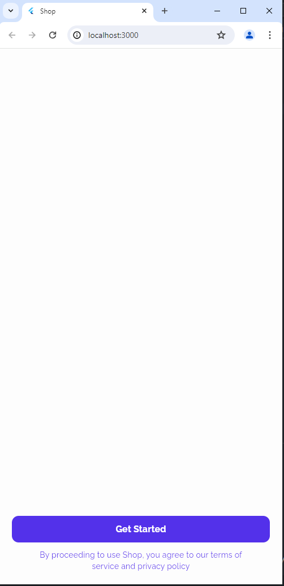
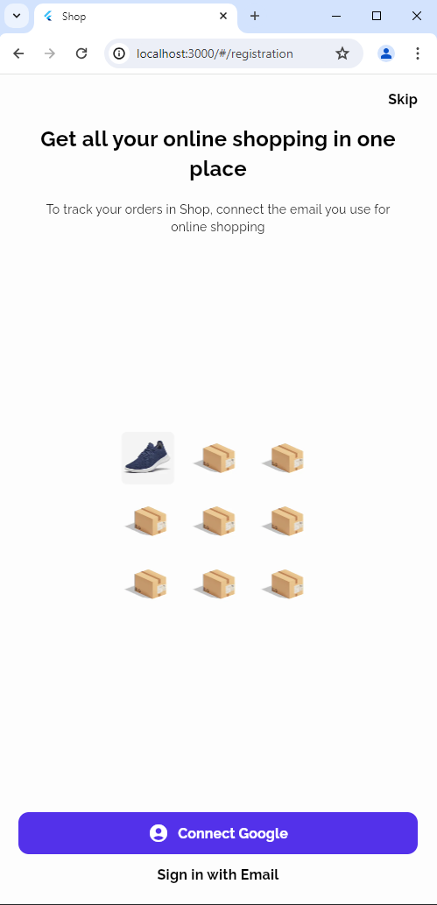
### Connection with google 
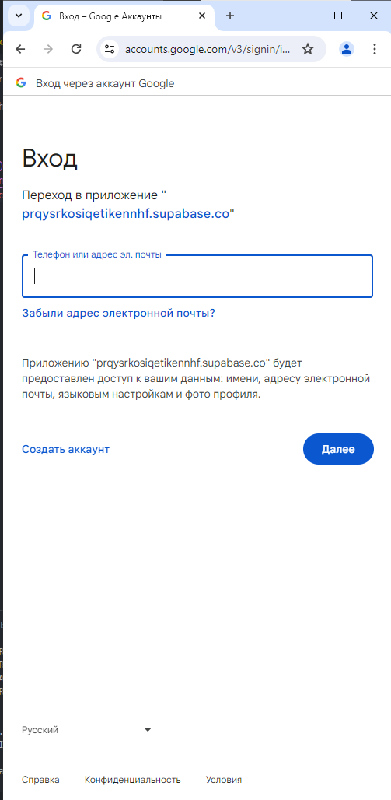

## Main page
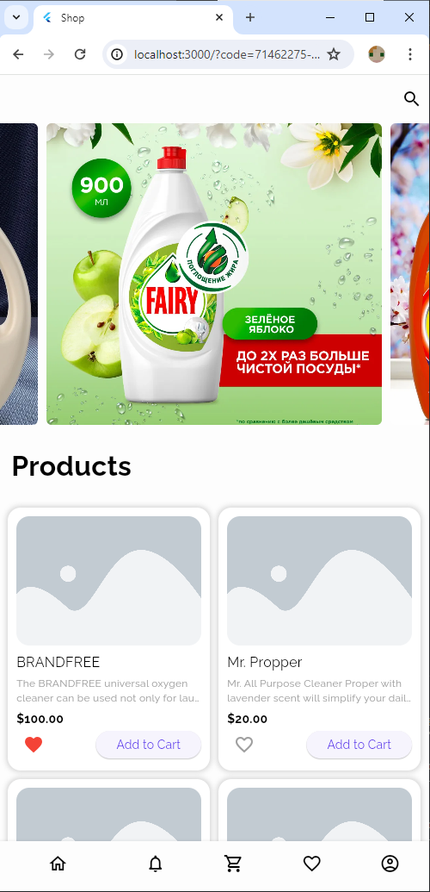

Main page have refresh for products 

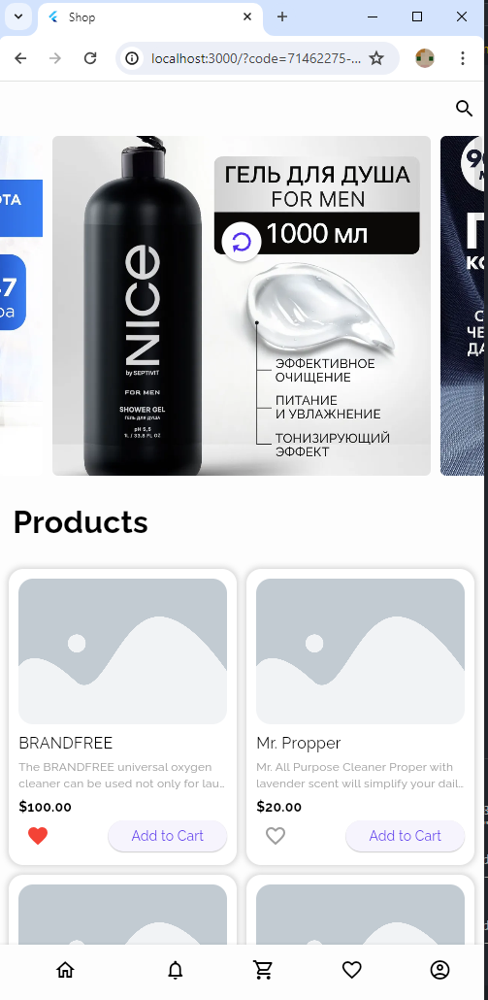
### Card 
Have add to cart and add to favorite
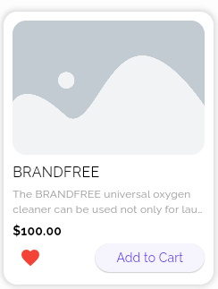

## Card product page 
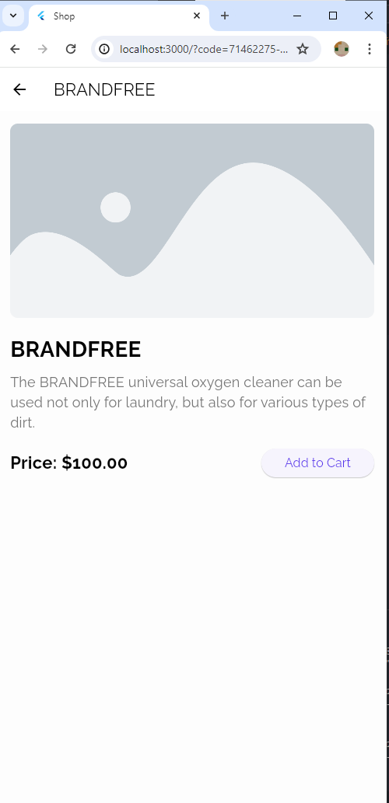

## Favorite page
Here is page with items with you add on yours profile 
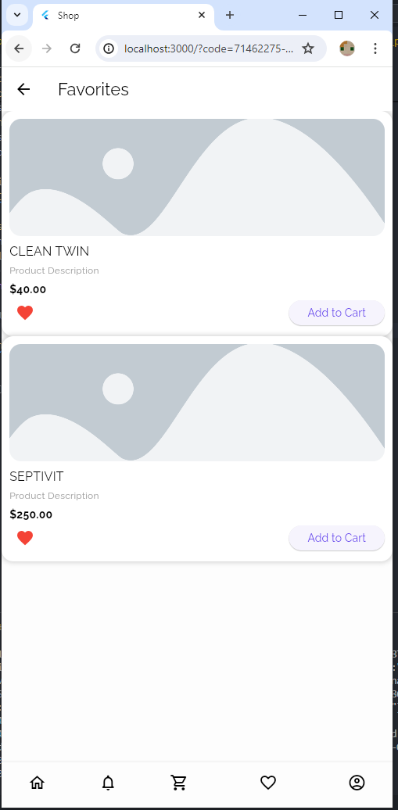

If user is not login he would see this message 

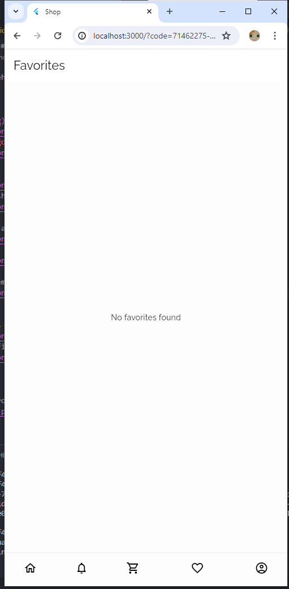

## Profile page 
Here user can see hes ID and email. Can left from profile
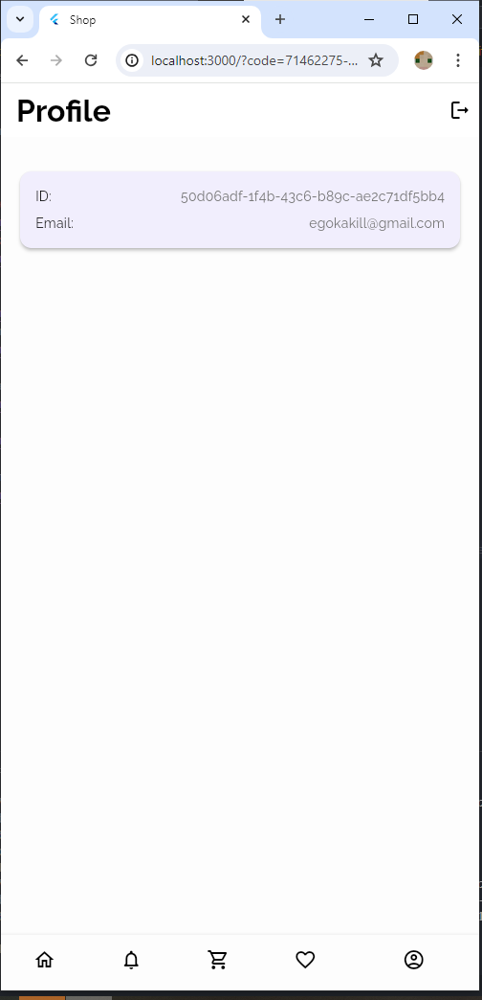

If you left from profile open popup

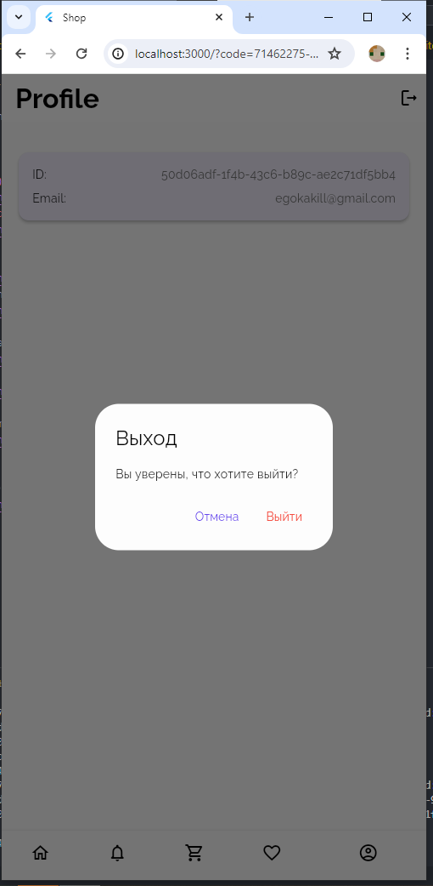

## Cart page 
Can add and delete products, shows price for all
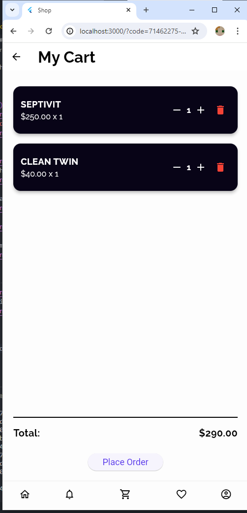